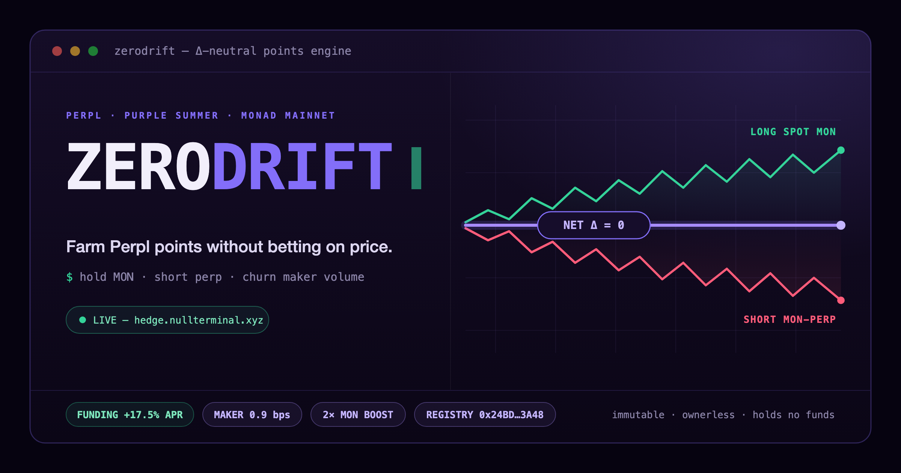
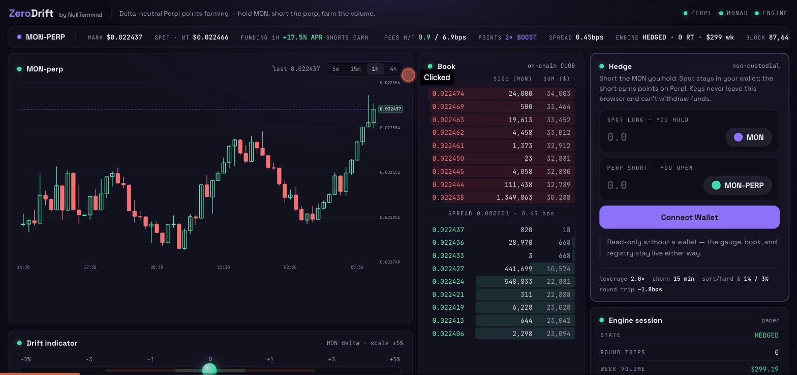

# ZeroDrift

**Farm Perpl points without betting on price — hold MON, short the perp, churn the volume.**



A delta-neutral points farmer for Perpl's "Purple Summer" mPoints on **Monad mainnet**:
two autonomous trading engines (simple churn vs. a real Avellaneda-Stoikov market maker)
racing on the same $100 hedge, a Perpl-style terminal streaming both live, and an
immutable on-chain registry attesting every hedge epoch. Live, deployed, non-custodial,
and honest about its costs.

## At a glance

| | |
|---|---|
| **Live app** | **https://hedge.nullterminal.xyz** — every number on the page is live; no mocks |
| **Contract** | [`0x24BD952B9BaD090Eab24A1a91948fA130c8D3A48`](https://monadscan.com/address/0x24BD952B9BaD090Eab24A1a91948fA130c8D3A48) — `HedgeRegistry.sol`, Monad mainnet (143) |
| **Verification** | Sourcify `exact_match` — creation **and** runtime bytecode |
| **Engines** | Two autonomous bots, 24/7: `churn` ([`/status.json`](https://hedge.nullterminal.xyz/status.json)) vs `avellaneda` ([`/status-avellaneda.json`](https://hedge.nullterminal.xyz/status-avellaneda.json)) — a live A/B on identical hedges |
| **Cloud runner** | Farm-as-a-service: any user runs their own 24/7 instance on our server with **one wallet signature** — [`/api/cloud/health`](https://hedge.nullterminal.xyz/api/cloud/health) is live ([docs](docs/cloud.md)) |
| **Real-money proof** | The full flow ran with **real funds on mainnet**: 2,818 MON spot vs 2,818 MON short, drift 0.00%, Avellaneda quoting live — a maker fill landed on camera ([demo](docs/assets/zerodrift-demo.gif)) |
| **Tests** | 9/9 Foundry (contracts) · 71 Bun tests (bot: 66 unit + 5 integration, incl. live-mainnet checks) |
| **Custody** | Non-custodial by construction — Perpl API keys cannot withdraw; go-live never puts a wallet key on the server |

## Verify every claim (≈5 minutes)

Everything above is machine-checkable. In order of effort:

1. **Open https://hedge.nullterminal.xyz** — live MON-perp chart, on-chain order book,
   both engine terminals, points estimator, epoch feed. Compare the mid price against
   [app.perpl.xyz](https://app.perpl.xyz) — same book.
2. **The engines are real processes, not UI props:**
   ```bash
   curl -s https://hedge.nullterminal.xyz/status.json            # churn engine — state, fills, round-trips, PnL
   curl -s https://hedge.nullterminal.xyz/status-avellaneda.json  # Avellaneda engine — spread capture, quotes
   ```
   `generatedAt` updates continuously; the event log shows maker fills against the live book.
3. **The contract is deployed and exactly matches this repo's source:**
   ```bash
   curl -s "https://sourcify.dev/server/v2/contract/143/0x24BD952B9BaD090Eab24A1a91948fA130c8D3A48"
   # → "creationMatch":"exact_match","runtimeMatch":"exact_match"
   cast code 0x24BD952B9BaD090Eab24A1a91948fA130c8D3A48 --rpc-url https://rpc.monad.xyz  # non-empty
   ```
   Deploy tx: `0x9d63893c688b0e57c5f9ecccba6a5b53aaa6592261e4d9ce148a283ab1481dfc`
4. **The cloud-runner API is a live service, not a mock:**
   ```bash
   curl -s https://hedge.nullterminal.xyz/api/cloud/health
   # → {"ok":true,"instances":N,"running":N,"max":8}
   ```
   Start/stop are gated by EIP-191 wallet signatures — try any mutation without one and
   you get a 401 (`bot/src/cloud/server.ts`).
5. **The tests pass:**
   ```bash
   cd contracts && forge test                 # 9/9 — incl. fuzz round-trip, cross-owner isolation
   cd bot && bun install && SKIP_LIVE=1 bun test   # 71 tests; drop SKIP_LIVE=1 to also hit live Perpl mainnet
   ```



## What it does

Points programs punish naive farming: taker fees plus directional exposure eat the reward.
ZeroDrift removes both.

- **Long spot MON** via the NullTerminal aggregator + **short MON-perp on Perpl** at equal
  notional → price moves cancel out. You hold the position with zero directional risk.
- **Farm maker volume** on the MON market, which carries a **2× points boost** — using
  PostOnly orders only, so every fill pays the **0.9bps maker fee**, never the 6.9bps taker.
- **It's not free — it's cheap, hedged, and measured.** The only real costs are fees and
  funding, and because the position is short, positive funding (currently ~+17.5% APR)
  **pays you** while it lasts. When funding turns >10% APR against the position, farming
  pauses automatically.

Net: PnL = spread captured − fees ± funding, decomposed to the cent on the live site,
while boosted weekly volume accrues.

## Two strategies, one honest A/B

Most farming bots are a single loop and a vibes-based PnL claim. ZeroDrift runs **two
real strategies side by side on identical $100 hedges** and streams both, so the
trade-off is measured, not asserted:

| | `churn` | `avellaneda` |
|---|---|---|
| **What it does** | Every 15 min, re-cycles 25% of the short with PostOnly maker round-trips | Continuous two-sided quoting (Avellaneda-Stoikov): reservation price + inventory skew, captures the spread |
| **Farms** | Raw boosted volume, predictably | Volume **plus** spread edge; self-balancing inventory |
| **Cost profile** | ~1.8bps per round-trip, always | Often net-positive: `spread captured − fees` |
| **Live feed** | [`/status.json`](https://hedge.nullterminal.xyz/status.json) | [`/status-avellaneda.json`](https://hedge.nullterminal.xyz/status-avellaneda.json) |

The terminal's **Compare tab** renders both engines' volume, fees, funding, spread capture
and net PnL from the same feeds you can `curl`. Spread capture is computed
direction-independently as `Σ |fill − mid| · size` — the true maker edge. Both strategies
share the FSM, safety rails, and go-live path; the strategy is a config switch.

## Proven with real money

The public demo engines run in paper mode — but the product is not a paper toy. On
2026-07-18 we ran the entire flow **with real funds on Perpl mainnet**, on camera:

- Wallet holding **2,818.5 MON** spot; one click opened a **2,818 MON short** (maker
  first, taker fallback) → drift indicator pinned at **Δ +0.00% · HEDGED**.
- The in-browser **Avellaneda quoter** then held two live 42-MON maker quotes ±6.5bps
  around mid, re-pricing with the market — visible both in ZeroDrift and in Perpl's own
  terminal (Open Orders / Positions).
- A **real maker fill** landed mid-recording: Perpl toast "position size 2776 was
  reduced", PnL ticked green, and the quoter re-quoted — exactly the loop the strategy
  promises. Footage: [`docs/assets/zerodrift-demo.gif`](docs/assets/zerodrift-demo.gif).

## Farm-as-a-service: the cloud runner

Watching a tab is not a product, so ZeroDrift ships one more layer: **any user can run
their own instance 24/7 on our server** — non-custodially — straight from the console:

- **One `personal_sign` to start, one to stop.** Every mutation is gated by an EIP-191
  signature over `zerodrift-cloud:<action>:<address>:<ts>` (±5-min window) — nobody can
  touch your instance without your wallet.
- Your Perpl trade keys are stored **AES-256-GCM encrypted**, decrypted only into your
  own container's env, never logged — and by Perpl protocol design **they cannot
  withdraw funds**. Spot stays in your wallet; the server never sees a wallet key.
- Each user gets an isolated container (`zd-u-<addr>`, CPU/mem-capped) and a personal
  live status feed (`/status-u-<id>.json`). Paper or LIVE per instance; caps: 8
  instances, $10–$200 notional. Full model + ops: [`docs/cloud.md`](docs/cloud.md).

## On-chain: `HedgeRegistry.sol`

A permissionless attestation log for hedge epochs — **deployed and Sourcify-verified** on
Monad mainnet, and **immutable, ownerless, holding no funds**.

Anyone can record their own hedge epochs, keyed by `msg.sender`: `openEpoch()` pairs a
spot leg (a NullTerminal swap tx) with a perp leg (a Perpl fill digest) at equal notional;
`closeEpoch()` finalizes it. Records are immutable once closed, readable via
`epochCount` / `getEpoch` views, with `EpochOpened` / `EpochClosed` events. The terminal
renders the live epoch feed from these views (the mainnet RPC caps `eth_getLogs` at 100
blocks, so the feed is view-driven plus a rolling live scan).

Why it matters: yield claims in this space are trust-me screenshots. A neutral, immutable
registry makes "I was hedged, at this size, over this window" **publicly provable** — for
anyone, not just this bot.

## The engine

A real autonomous bot (Bun + TypeScript), not a UI toy. Both instances run 24/7 as docker
containers on a VPS in **paper mode** — simulating maker fills against the live mainnet
order book, streaming rolling logs, state, and volume to the site. The exact same code
path goes live with operator keys.

```
INIT → SPOT_FILLED → HEDGED ⇄ CHURNING / REBALANCING / PAUSED_FUNDING → UNWINDING → CLOSED
```

**Safety rails (all in code, all tested):**

| Guard | Behavior |
|---|---|
| Paper by default | Live requires `HEDGER_LIVE=true` **and** all operator env vars — otherwise it can only simulate |
| Delta guard | Soft 1% / hard 3%; rebalances maker-first, taker only past hard |
| Funding pause | Auto-pauses farming above 10% APR against the position, resumes below 5% |
| Taker cap | Hard daily taker-spend cap ($25 default); over budget → maker-only |
| Non-custodial | Perpl API keys **cannot withdraw**; the bot never generates, stores, or logs private keys |
| Owner-held spot | Go-live fast path: you keep the spot MON in your own wallet — **no wallet key ever touches the VPS** ([`docs/golive.md`](docs/golive.md)) |
| Kill switch | `docker stop`, or `HEDGER_UNWIND=true` to exit the position cleanly first |
| Watchdogs | Stale-book restart, margin-pressure auto-unwind, Telegram alerts on every live action |

## Architecture

```
zerodrift/
├── contracts/   Foundry — HedgeRegistry.sol (+ 9 tests, deploy script)
├── bot/         Bun + TypeScript — the autonomous engines
│   └── src/
│       ├── lib/perpl.ts        public market-data WS (L2 book, funding, candles)
│       ├── lib/perpl-trade.ts  authenticated trading WS (Ed25519, orders,
│       │                       rq idempotency, re-post loop, paper/live seam)
│       ├── hedger/             FSM (run.ts) · churn + avellaneda strategies ·
│       │                       funding · maker · pnl · spot leg (NullTerminal) ·
│       │                       on-chain registry · CLIs (enroll, bootstrap)
│       └── cloud/              zd-cloud — per-user 24/7 instances: wallet-signed
│                               start/stop API · AES-GCM key vault · docker spawn
└── web/         Vite + React + viem — the live terminal
    └── src/components/  chart · book ladder · hedge console · cloud runner ·
                         drift gauge · engine terminals · strategy compare ·
                         epoch history · points estimator
```

The UI carries the NullTerminal design system — Space Grotesk + JetBrains Mono, a
violet/mint glass palette — rendered as an avionics-style instrument terminal.

## Integrations

| Integration | What it powers |
|---|---|
| **Perpl** (perp CLOB) | Market-data WS (L2 book, funding), candle stream, and an authenticated trading WS signed with **Ed25519** API keys |
| **NullTerminal** aggregator | The spot leg — quote → swap for the MON long, via NT's public API |
| **Monad mainnet** | `HedgeRegistry` epoch attestations + all on-chain reads |

**Engineering walls we actually hit and solved:**

- Perpl rejects foreign browser Origins (REST sends no CORS headers, WS closes `1002`) →
  a same-origin `/perpl` proxy via Caddy rewrites the `Origin` header so the browser can
  talk to Perpl directly.
- `rpc.monad.xyz` caps `eth_getLogs` at 100 blocks → the epoch feed is built from
  contract views plus a rolling 100-block scan instead of a full log query.
- viem's EIP-712 signing needs the **full** type set (including `EIP712Domain`,
  hex-string `chainId`) to reproduce Perpl's exact digest — the ethers convention of
  stripping it breaks auth with a 400.
- A duplicate heartbeat sequence number on Perpl's WS is not a gap — treating it as one
  caused false reconnect storms until the dedup landed.

## What's real vs. what's simulated

Honesty is part of the product, so to be explicit:

- **Real:** the Monad mainnet contract and every epoch in it; the market data (order
  book, funding, candles — straight from Perpl mainnet); the Ed25519 trading auth; the
  spot quotes; both engines as 24/7 processes; every number on the site.
- **Simulated:** the public demo engines fill their maker orders *against the live book*
  in **paper mode** — no real funds are at risk on the public deployment. Going live is
  the documented one-command flip ([`docs/golive.md`](docs/golive.md)) through the exact
  same code path, and the fine print (what earns points, what doesn't, the risks) is in
  the [in-app guide](https://hedge.nullterminal.xyz/#/guide).

## Tests

| Suite | Command | Coverage |
|---|---|---|
| Contract | `cd contracts && forge test` | **9/9** — store/emit, close guards, cross-owner isolation, fuzz round-trip |
| Bot unit | `cd bot && bun test test/unit` | **66** — churn-policy regimes & safety rails, Avellaneda quoting math, funding APR/hysteresis + sign handling, VWAP/PnL math, Ed25519 sign-in round-trip, trend gating, ISO-week bucketing, cloud runner (key crypto round-trip, signature gate, validation caps, spawn-args hygiene) |
| Bot integration | `cd bot && bun test test/integration` | **5** — PaperPerplExecutor full order lifecycle (maker fill → position → balance, taker close) + live Perpl mainnet coherence checks |

Full bot suite: `cd bot && bun test` — 71 tests. The 2 live-mainnet tests skip under
`SKIP_LIVE=1`. The cloud runner was additionally verified end-to-end on production with
a burner wallet: start → personal feed live → wrong-wallet stop rejected (401) →
stop+forget clean.

## Run it yourself

```bash
cd bot && bun install

# enroll a Perpl trading key (EIP-712; never writes secrets to disk)
ENROLL_PRIVATE_KEY=0x<key> bun run hedger:enroll

# on-chain exchange account + AUSD deposit
HEDGER_PRIVATE_KEY=0x<key> MONAD_RPC_URL=https://rpc.monad.xyz bun run hedger:bootstrap --deposit 50

# run the engine — PAPER by default; HEDGER_LIVE=true + operator keys to go live
bun run hedger
```

Going live with real funds is a one-command runbook — including the **owner-held-spot
fast path** where no wallet key ever touches the server: [`docs/golive.md`](docs/golive.md).

Contract side: `cd contracts && forge test`, deploy via `script/deploy-hedge-registry.sh`.

## Built for Monad Spark

A 6-day on-chain build, shipped end to end: an immutable verified contract on Monad
mainnet · two autonomous engines racing live in a measured A/B · a real
Avellaneda-Stoikov market maker · a non-custodial in-browser trading console ·
**farm-as-a-service cloud instances gated by wallet signatures** · and the whole flow
**proven with real funds on mainnet, on camera** — deployed at
**https://hedge.nullterminal.xyz**, safe by default, honest about every cost.

---

*Powered by [NullTerminal](https://nullterminal.xyz). MIT licensed.*
